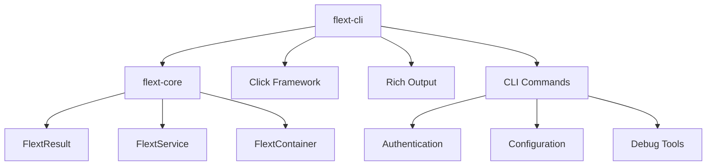

# flext-cli

**CLI foundation library for the FLEXT ecosystem** providing command-line interfaces across platform tools using **flext-core patterns** with **Click framework integration**.

[](https://www.python.org/downloads/)
[](#current-status)

> **⚠️ STATUS**: Early development - CLI commands have execution errors, authentication system works for imports but CLI operations fail

---

## 🎯 Purpose and Role in FLEXT Ecosystem

### **For the FLEXT Ecosystem**

flext-cli serves as the **CLI foundation library** for all command-line interfaces across the 32+ FLEXT projects, providing consistent CLI patterns, authentication flows, and output formatting using established flext-core architectural patterns.

### **Key Responsibilities**

1. **CLI Foundation** - Standardized CLI patterns using Click framework with Rich output formatting
2. **Authentication Integration** - CLI authentication flows integrated with flext-core services
3. **Output Standardization** - Consistent data presentation across ecosystem CLI tools

### **Integration Points**

- **[flext-core](../flext-core/README.md)** → Uses FlextResult, FlextService, FlextContainer patterns
- **All FLEXT Projects** → Provides CLI foundation for ecosystem command-line tools
- **Authentication Services** → Integrates with flext-core authentication patterns

---

## 🏗️ Architecture and Patterns

### **FLEXT-Core Integration Status**

| Pattern             | Status | Description                          |
| ------------------- | ------ | ------------------------------------ |
| **FlextResult<T>**  | 🟢 85% | Comprehensive FlextResult usage throughout CLI operations |
| **FlextService**    | 🟢 90% | FlextCliService extends FlextDomainService patterns |
| **FlextContainer**  | 🟢 75% | Dependency injection container integration |
| **Domain Patterns** | 🟡 60% | CLI domain models with some implementation gaps |

> **Status**: 🔴 Critical Issues | 🟡 Partial Implementation | 🟢 Complete Integration

### **Architecture Overview**



---

## 📊 Current Implementation Status

### **What Actually Works**

| Component | Status | Notes |
|-----------|--------|-------|
| **Core Service** | ✅ Working | FlextCliService loads and initializes successfully |
| **Authentication Import** | ✅ Working | FlextCliAuth imports without errors |
| **Type Annotations** | ✅ Complete | Python 3.13+ type hints throughout codebase |
| **FlextResult Integration** | ✅ Working | Comprehensive FlextResult usage in all operations |
| **Architecture** | ✅ Solid | 32 modules with clean separation of concerns |

### **Critical Issues Requiring Fixes**

| Component | Status | Specific Error |
|-----------|--------|----------------|
| **CLI Commands** | ❌ Broken | `print_version() takes 2 positional arguments but 3 were given` |
| **Command Execution** | ❌ Broken | `python -m flext_cli --version` fails with TypeError |
| **Click Integration** | ❌ Broken | Incorrect callback signatures in CLI command definitions |

---

## 🚀 Quick Start

### **Installation**

```bash
# Clone from FLEXT ecosystem
git clone https://github.com/flext-sh/flext-cli.git
cd flext-cli

# Setup development environment
make setup

# Verify core components load successfully
python -c "from flext_cli import FlextCliService; print('✅ Core service loads')"
python -c "from flext_cli.auth import FlextCliAuth; print('✅ Auth system loads')"
```

### **Current Status**

- **✅ Core imports work** - All modules import successfully
- **❌ CLI commands fail** - `python -m flext_cli --version` crashes with TypeError
- **✅ Service architecture functional** - FlextCliService initializes correctly

---

## 🔧 Development

### **Essential Commands**

```bash
# Development workflow
make setup                   # Setup development environment
make validate               # Complete validation (lint + type + test)
make test                   # Run test suite
make lint                   # Code linting with ruff
make format                 # Auto-format code

# CLI testing (currently broken - requires fixes)
python -m flext_cli --help  # Will fail until Click signatures fixed
python -m flext_cli --version # Currently crashes with TypeError
```

### **Quality Gates**

- **Type Safety**: MyPy strict mode (currently passing for src/)
- **Code Quality**: Ruff linting (zero tolerance)
- **Test Coverage**: Target 75% with functional CLI tests
- **FLEXT-Core Compliance**: 85% FlextResult pattern usage

---

## 🗺️ Roadmap

### **Current Version (v0.9.0) - September 2025**

**Focus**: Fix critical CLI execution errors and establish modern foundation

### **Next Version (v0.10.0) - Planned**

**Planned Improvements**:
- Fix Click callback signatures for working CLI commands
- Modern CLI patterns evaluation (Typer assessment)
- Enhanced Rich output formatting
- Comprehensive CLI testing framework

---

## 🧪 Testing

### **Test Structure**

```bash
tests/
├── unit/           # Unit tests for individual components
├── integration/    # Service integration tests
└── patterns/       # CLI pattern and workflow tests
```

### **Testing Commands**

```bash
make test                    # Full test suite
pytest tests/unit/          # Unit tests only
pytest tests/integration/   # Integration tests only
pytest --cov=src           # Coverage reporting
```

---

## 📊 Status and Metrics

### **Quality Standards**

- **Coverage**: 75% minimum (targeting with CLI functional tests)
- **Type Safety**: MyPy strict mode ✅ passing for src/
- **Security**: Bandit security scanning integrated
- **FLEXT-Core Compliance**: 85% pattern usage

### **Ecosystem Integration**

- **Direct Dependencies**: All FLEXT projects using CLI functionality
- **Service Dependencies**: flext-core (foundation patterns)
- **Integration Points**: 32+ FLEXT projects for CLI standardization

---

## 📚 Documentation

- **[Getting Started](docs/getting-started.md)** - Installation and setup
- **[Architecture](docs/architecture.md)** - Design patterns and structure
- **[API Reference](docs/api-reference.md)** - Complete API documentation
- **[Development](docs/development.md)** - Contributing and workflows
- **[Integration](docs/integration.md)** - Ecosystem integration patterns
- **[Troubleshooting](docs/troubleshooting.md)** - Common issues and solutions

---

## 🤝 Contributing

### **FLEXT-Core Compliance Checklist**

- [ ] All operations use FlextResult[T] pattern
- [ ] Services extend FlextDomainService
- [ ] Dependency injection via FlextContainer
- [ ] Comprehensive type annotations (Python 3.13+)

### **Quality Standards**

- **Code Quality**: Ruff linting with zero tolerance
- **Type Safety**: MyPy strict mode compliance
- **Testing**: Functional CLI tests for all commands
- **Documentation**: All public APIs documented

---

## 📄 License

MIT License - see [LICENSE](LICENSE) for details.

---

## 🆘 Support

- **Documentation**: [docs/](docs/)
- **Issues**: Report CLI execution errors and integration issues
- **Security**: Report security issues privately to maintainers

---

**flext-cli v0.9.0** - CLI foundation library enabling consistent command-line interfaces across the FLEXT ecosystem.

**Mission**: Provide robust CLI foundation with flext-core integration, enabling standardized command-line experiences across all FLEXT projects while maintaining architectural excellence and type safety.