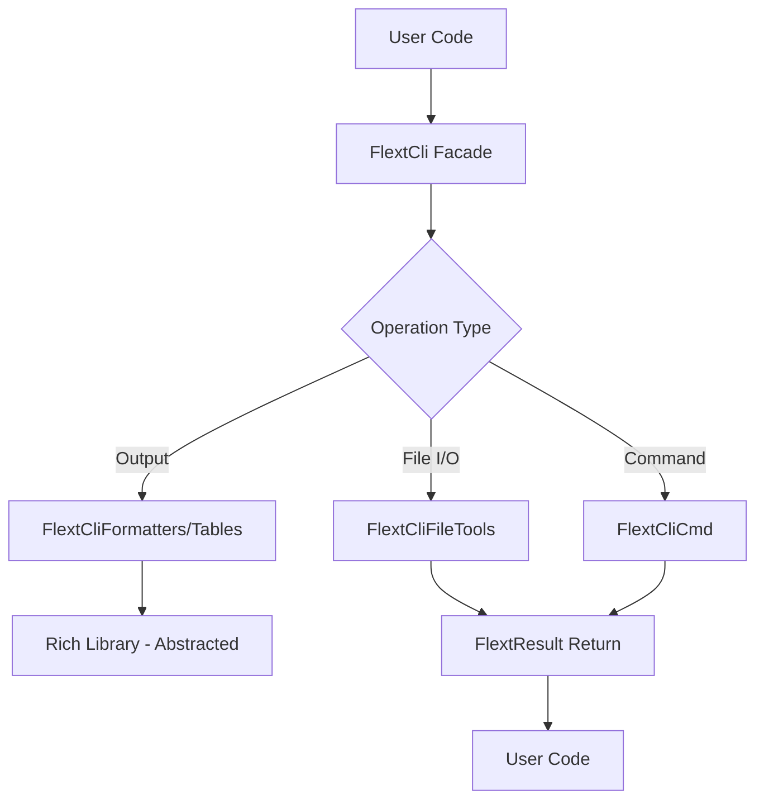

# CLI Architecture

**flext-cli structure and design patterns for CLI foundation library.**

**Last Updated**: 2025-10-10 | **Version**: 0.9.0

---

## Architecture Overview

### Design Philosophy

flext-cli provides a **CLI foundation library** for the FLEXT ecosystem using a domain library architecture with strict framework abstraction.

**Core Principles**:

- **ZERO TOLERANCE Framework Isolation** - Click/Rich imports strictly controlled
- **Unified Class Pattern** - Single class per module following domain library design
- **Railway-Oriented Programming** - All operations return `FlextResult[T]`
- **Type Safety First** - Python 3.13+ with 100% type annotations
- **Singleton Configuration** - Global configuration with environment variable support

---

## Module Structure (24 Files, ~370K Lines)

### Core API Layer

```
src/flext_cli/
├── __init__.py          # Public API exports (19 classes)
├── __version__.py       # Version information
├── api.py               # FlextCli - main facade API (16K lines)
└── py.typed             # PEP 561 type marker
```

### Framework Abstraction Layer (ZERO TOLERANCE)

```
├── cli.py               # FlextCliCli - Click abstraction (ONLY Click import) (22K)
├── cli_params.py        # FlextCliCommonParams - reusable parameters (17K)
├── formatters.py        # FlextCliFormatters - Rich abstraction (ONLY Rich import) (11K)
└── tables.py            # FlextCliTables - Tabulate integration (22+ formats) (14K)
```

**CRITICAL**: These are the ONLY files that may import Click or Rich directly.

### Configuration & Constants Layer

```
├── config.py            # FlextCliConfig - singleton configuration (26K)
├── constants.py         # FlextCliConstants - all system constants (34K)
├── models.py            # FlextCliModels - ALL Pydantic models (55K)
├── typings.py           # FlextCliTypes - type aliases (13K)
├── protocols.py         # FlextCliProtocols - structural typing (4K)
└── exceptions.py        # FlextCliExceptions - exception hierarchy (12K)
```

### Service Layer

```
├── core.py              # FlextCliCore - extends FlextCore.Service (29K)
├── cmd.py               # FlextCliCmd - command execution (12K)
├── commands.py          # FlextCliCommands - command management (10K)
├── context.py           # FlextCliContext - execution context (10K)
├── debug.py             # FlextCliDebug - debug utilities (12K)
└── mixins.py            # FlextCliMixins - reusable mixins (10K)
```

### I/O Layer

```
├── output.py            # FlextCliOutput - output management (26K)
├── prompts.py           # FlextCliPrompts - interactive input (22K)
└── file_tools.py        # FlextCliFileTools - file operations (24K)
```

---

## Architectural Patterns

### Unified Class Pattern (Domain Library)

Each module exports exactly ONE class containing all functionality:

```python
# Each module follows this pattern
class FlextCliFormatters:
    """Single class containing ALL formatting functionality."""
    # All methods related to formatting are here

class FlextCliTables:
    """Single class containing ALL table functionality."""
    # All methods related to tables are here

class FlextCliModels:
    """Single class containing ALL Pydantic models as nested classes."""
    class CommandExecutionConfig(BaseModel): ...
    class LoggingConfig(BaseModel): ...
    # All 50+ models defined as nested classes
```

### FlextResult[T] Railway Pattern

ALL operations that can fail must return `FlextResult[T]`:

```python
from flext_core import FlextResult
from flext_cli import FlextCliFileTools

file_tools = FlextCliFileTools()

# Chain operations
result = (
    file_tools.read_json_file("config.json")
    .flat_map(lambda data: validate_config(data))
    .map(lambda config: apply_defaults(config))
    .map_error(lambda err: log_error(err))
)

# Safe unwrapping
if result.is_success:
    config = result.unwrap()
else:
    print(f"Error: {result.error}")
```

### Execution Flow



### Configuration Singleton Pattern

Configuration uses global singleton with environment support:

```python
from flext_cli import FlextCliConfig

# Get singleton instance (creates on first call)
config = FlextCliConfig.get_global_instance()

# Read-only properties with env var fallback
debug = config.debug               # FLEXT_DEBUG
output_format = config.output_format  # FLEXT_OUTPUT_FORMAT
timeout = config.timeout           # FLEXT_TIMEOUT
```

---

## ZERO TOLERANCE Framework Isolation

### Click Abstraction (cli.py ONLY)

```python
# ❌ FORBIDDEN in all files except cli.py
import click
from click import command, option

# ✅ CORRECT - Use FlextCliCli abstraction
from flext_cli import FlextCliCli

cli = FlextCliCli()
# All Click functionality accessed through this abstraction
```

### Rich Abstraction (formatters.py & typings.py ONLY)

```python
# ❌ FORBIDDEN in all files except formatters.py and typings.py
from rich.console import Console
from rich.table import Table

# ✅ CORRECT - Use FlextCliFormatters abstraction
from flext_cli import FlextCliFormatters

formatters = FlextCliFormatters()
formatters.print_text("Hello", style="green")
```

**Purpose**: Isolates framework dependencies, enabling:
- Framework version upgrades without ecosystem-wide changes
- Potential migration to alternatives (e.g., Typer) in future
- Consistent API across 32+ dependent projects

---

## Output and Formatting Architecture

### Three-Layer Output System

1. **FlextCli Facade** - Simple convenience methods
2. **FlextCliOutput** - Structured output management
3. **FlextCliFormatters/Tables** - Direct Rich/Tabulate access

```python
from flext_cli import FlextCli

cli = FlextCli()

# Layer 1: Simple facade methods
cli.success("Operation completed!")
cli.error("Something went wrong")
cli.warning("Proceed with caution")

# Layer 2: Structured output
cli.output.display_json({"key": "value"})
cli.output.display_yaml(data)

# Layer 3: Direct formatting control
cli.formatters.print_text("Custom", style="bold blue")
cli.tables.create_table(data, format="fancy_grid")
```

---

## Extension Patterns

### Adding New Functionality

1. **Extend FlextCli with New Methods**

   ```python
   # In api.py, add new methods to FlextCli class
   from flext_core import FlextResult

   class FlextCli:
       def new_operation(self, data: dict) -> FlextResult[str]:
           """New CLI operation."""
           # Use existing services
           result = self.file_tools.read_json_file("data.json")
           return result.map(lambda d: process_data(d))
   ```

2. **Add to Appropriate Service Module**

   ```python
   # In file_tools.py, cmd.py, output.py, etc.
   class FlextCliFileTools:
       def new_file_operation(self, path: Path) -> FlextResult[str]:
           """New file operation."""
           # Implementation using FlextResult
           return FlextResult[str].ok("success")
   ```

3. **Update Models if Needed**

   ```python
   # In models.py - add new Pydantic models
   class FlextCliModels:
       class NewConfigModel(BaseModel):
           """New configuration model."""
           field: str
           value: int
   ```

4. **Add Tests with Fixtures**

   ```python
   # In tests/unit/test_new_feature.py
   def test_new_operation(flext_cli_api: FlextCli):
       """Test new operation."""
       result = flext_cli_api.new_operation({"key": "value"})
       assert result.is_success
   ```

### Extending for Ecosystem Projects

```python
from flext_cli import FlextCli
from flext_core import FlextResult

class MyProjectCli(FlextCli):
    """Custom CLI for your project."""

    def custom_command(self, args: dict) -> FlextResult[str]:
        """Project-specific command."""
        # Use inherited CLI functionality
        self.print("Running custom command...")
        return FlextResult[str].ok("complete")
```

---

## Quality and Testing

### Testing Architecture

- **Unit Tests** - Individual component testing
- **Integration Tests** - CLI command end-to-end testing
- **Functional Tests** - User workflow testing

### Quality Standards

- **Type Safety** - MyPy strict mode compliance
- **Code Quality** - Ruff linting standards
- **Error Handling** - FlextResult pattern usage
- **Documentation** - All public APIs documented

---

## Framework Dependencies

### Click Framework (8.2+)

- **Usage**: Command-line interface framework (abstracted)
- **Isolation**: ONLY imported in `cli.py` (ZERO TOLERANCE)
- **Why**: Mature, stable, widely used
- **Status**: Isolated for potential future migration

### Rich Library (14.0+)

- **Usage**: Terminal output formatting with beautiful colors/tables
- **Isolation**: ONLY imported in `formatters.py` and `typings.py` (ZERO TOLERANCE)
- **Why**: Best-in-class terminal UI library
- **Status**: Fully abstracted through FlextCliFormatters

### Tabulate (0.9+)

- **Usage**: Table formatting with 22+ output formats
- **Isolation**: Imported in `tables.py` only
- **Why**: Wide format support (markdown, HTML, LaTeX, etc.)
- **Status**: Integrated via FlextCliTables

### Pydantic (2.11+)

- **Usage**: Data validation and configuration management
- **Where**: All models in `models.py` (55K lines)
- **Why**: Best-in-class validation with type safety
- **Status**: Core dependency

### FLEXT Ecosystem Integration

| Package | Role | Integration Point |
|---------|------|-------------------|
| **flext-core** | Foundation patterns | FlextResult, FlextCore.Service, FlextCore.Container |
| **flext-api** | HTTP operations | Optional integration for API CLIs |
| **flext-observability** | Monitoring | Optional logging/metrics integration |
| **32+ projects** | Consumers | All use flext-cli for CLI functionality |

---

## Quality Standards

- **Type Safety**: MyPy strict mode, 100% type annotations
- **Test Coverage**: 94.1% pass rate (665 passing tests)
- **Code Quality**: Ruff linting with ZERO tolerance
- **Security**: Bandit security scanning
- **Documentation**: Comprehensive docs + examples

---

**Last Updated**: 2025-10-10 | **Version**: 0.9.0

For API details, see [api-reference.md](api-reference.md).
For development guidelines, see [development.md](development.md).
For getting started, see [getting-started.md](getting-started.md).
