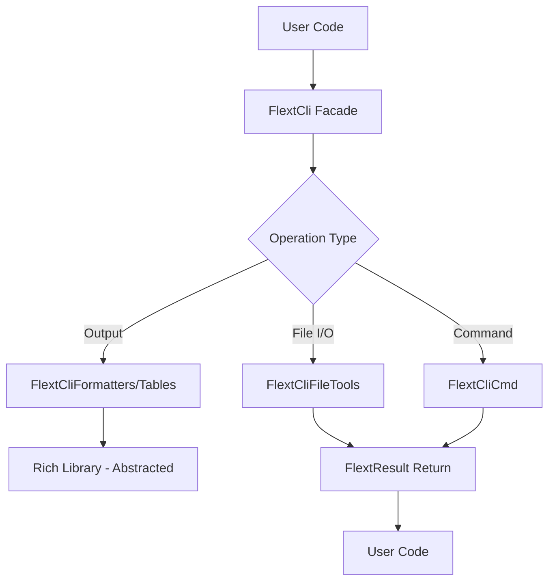

# CLI Architecture

**flext-cli structure and design patterns for CLI foundation library.**

**Last Updated**: 2025-01-24 | **Version**: 0.10.0

---

## 📌 Quick Navigation

- [v0.10.0 Architecture (Current)](#v0100-architecture-current) ← **Start Here**
- [v0.9.0 Architecture (Historical Reference)](#v090-architecture-historical-reference)

---

## v0.10.0 Architecture (Current)

**Status**: 📝 Planned | **Release**: Q1 2025 | **Breaking Changes**: Yes

### Overview

FLEXT-CLI v0.10.0 introduces a simplified, cleaner architecture by removing over-engineering and aligning with core design principles. The refactoring reduces complexity by 30-40% while maintaining all essential functionality.

**Key Improvements**:
- **Service Classes**: 18 → 3-4 (75% reduction)
- **Lines of Code**: ~14,000 → ~10,000 (30% reduction)
- **API Methods**: ~30 → ~15 (50% reduction)
- **Architecture**: Services only for state, simple classes for utilities
- **Pattern**: Direct access (no wrapper methods)

### Design Principles

1. **Services Only for State** - Use FlextService only when managing stateful logic
2. **Simple Classes for Utilities** - Stateless operations use simple classes
3. **Value Objects for Data** - Immutable data models using Pydantic
4. **Direct Access Pattern** - No thin wrappers, explicit ownership
5. **Zero Unused Infrastructure** - No async, threading, or plugins unless needed

---

### Module Classification

#### 🎯 Services (Stateful - 3-4 Only)

**Use FlextService when**:
- Class manages mutable state (commands, sessions, configuration)
- Class requires dependency injection
- Class needs lifecycle management
- Class has complex initialization

```python
# ✅ FlextCliCore - Stateful service
from flext_core import FlextService

class FlextCliCore(FlextService[CliDataDict]):
    """Manages commands, sessions, and configuration lifecycle."""

    def __init__(self):
        super().__init__()
        self._commands: dict[str, Command] = {}  # STATE
        self._sessions: dict[str, Session] = {}  # STATE
        self._config: FlextCliConfig = FlextCliConfig()  # STATE
```

**Services in v0.10.0**:
1. **FlextCliCore** - Command/session management ✅
2. **FlextCli** - Main API facade (singleton) ✅
3. **FlextCliCmd** - Command execution (evaluate) ⚠️

#### 🔧 Simple Classes (Utilities - 10+)

**Use simple classes when**:
- Class is stateless
- Methods could be static
- No dependency injection needed
- Just utility functions grouped together

```python
# ✅ FlextCliFileTools - Simple utility class
from flext_core import FlextResult

class FlextCliFileTools:
    """Stateless file operations."""

    @staticmethod
    def read_json_file(path: str) -> FlextResult[dict]:
        """Read JSON file - no state needed."""
        try:
            with open(path) as f:
                return FlextResult[dict].ok(json.load(f))
        except Exception as e:
            return FlextResult[dict].fail(str(e))
```

**Simple Classes in v0.10.0**:
- **FlextCliFileTools** - File I/O operations
- **FlextCliFormatters** - Rich formatting (already simple)
- **FlextCliTables** - Table generation
- **FlextCliOutput** - Output management
- **FlextCliPrompts** - User input
- **FlextCliDebug** - Debug utilities
- **FlextCliCommands** - Command registry

#### 📦 Data Models (Value Objects)

**Use value objects when**:
- Class is immutable data
- Compared by value, not identity
- No behavior, just data validation
- Pydantic model is appropriate

```python
# ✅ FlextCliContext - Value Object
from flext_core import FlextModels
from pydantic import Field

class FlextCliContext(FlextModels.Value):
    """Immutable execution context."""
    command: str | None = None
    arguments: list[str] = Field(default_factory=list)
    environment_variables: dict[str, object] = Field(default_factory=dict)
    working_directory: str | None = None

    # No methods - just validated, immutable data
```

**Value Objects in v0.10.0**:
- **FlextCliContext** - Execution context (changed from service)
- **All FlextCliModels.*** - Configuration and data models

---

### Direct Access Pattern

The core change in v0.10.0 is removing wrapper methods in favor of direct access to underlying services.

#### ❌ Old Pattern (v0.9.0): Wrapper Methods

```python
from flext_cli import FlextCli

cli = FlextCli()

# Multiple ways to do the same thing (confusing!)
cli.print("Hello")                     # Wrapper method
cli.formatters.print("Hello")          # Direct access

# Which one should I use?
```

#### ✅ New Pattern (v0.10.0): Direct Access

```python
from flext_cli import FlextCli

cli = FlextCli()

# One clear way - direct access with explicit ownership
cli.formatters.print("Hello")                          # Formatting
cli.file_tools.read_json_file("config.json")           # File I/O
cli.prompts.confirm("Continue?")                       # User input
cli.output.format_data(data, format_type="table")      # Output
```

**Benefits**:
- **Clear ownership** - Which service handles what is explicit
- **No duplicate API** - Only one way to do things
- **Easier to document** - Single source of truth
- **Better IDE support** - Clearer autocomplete
- **Performance** - One less indirection level

---

### Module Structure (v0.10.0)

```
src/flext_cli/
├── __init__.py          # Public API exports
├── __version__.py       # Version: 0.10.0
├── py.typed             # PEP 561 type marker

# SERVICES (3-4 only)
├── core.py              # FlextCliCore - stateful service
├── api.py               # FlextCli - main facade (singleton)
├── cmd.py               # FlextCliCmd - command execution (evaluate)

# FRAMEWORK ABSTRACTION (ZERO TOLERANCE)
├── cli.py               # FlextCliCli - Click abstraction (ONLY Click import)
├── cli_params.py        # FlextCliCommonParams - reusable parameters

# SIMPLE CLASSES (utilities)
├── formatters.py        # FlextCliFormatters - Rich formatting
├── tables.py            # FlextCliTables - table formatting
├── output.py            # FlextCliOutput - output management
├── prompts.py           # FlextCliPrompts - user input
├── file_tools.py        # FlextCliFileTools - file operations
├── debug.py             # FlextCliDebug - debug utilities
├── commands.py          # FlextCliCommands - command registry

# DATA MODELS & CONFIGURATION
├── context.py           # FlextCliContext - value object (changed!)
├── config.py            # FlextCliConfig - configuration
├── models.py            # FlextCliModels - Pydantic models
├── constants.py         # FlextCliConstants - system constants
├── typings.py           # FlextCliTypes - type aliases
├── protocols.py         # FlextCliProtocols - structural typing
├── exceptions.py        # FlextCliExceptions - exception hierarchy
└── mixins.py            # FlextCliMixins - reusable mixins

# DELETED (no longer needed)
# validator.py           # Empty stub - removed
# auth.py                # Duplicate of api.py auth - removed
# testing.py             # Moved to tests/fixtures/
```

**Total**: 20 modules (down from 24)

---

### Architecture Diagram (v0.10.0)

```
┌─────────────────────────────────────────────────────────────┐
│                    FlextCli (Main Facade)                     │
│  - Singleton pattern                                          │
│  - Core initialization                                        │
│  - Authentication (business logic, not delegation)            │
│  - CLI execution orchestration                                │
└─────────────────────────────────────────────────────────────┘
                              │
        ┌─────────────────────┼─────────────────────┐
        │                     │                     │
        ▼                     ▼                     ▼
┌──────────────────┐  ┌──────────────────┐  ┌──────────────────┐
│ FlextCliCore     │  │ FlextCliCmd      │  │ Simple Classes   │
│ (Service)        │  │ (Service?)       │  │ (Utilities)      │
│                  │  │                  │  │                  │
│ • Commands       │  │ • Execute        │  │ • FileTools      │
│ • Sessions       │  │ • Validate       │  │ • Formatters     │
│ • Config         │  │                  │  │ • Tables         │
│ • Statistics     │  │                  │  │ • Output         │
│                  │  │                  │  │ • Prompts        │
│                  │  │                  │  │ • Debug          │
└──────────────────┘  └──────────────────┘  └──────────────────┘
        │                     │                     │
        └─────────────────────┼─────────────────────┘
                              │
                              ▼
                ┌──────────────────────────┐
                │   Data Models            │
                │   (Value Objects)        │
                │                          │
                │ • FlextCliContext        │
                │ • FlextCliModels.*       │
                │ • FlextCliConfig         │
                └──────────────────────────┘
```

---

### Usage Examples (v0.10.0)

#### Example 1: File Operations

```python
from flext_cli import FlextCli

cli = FlextCli()

# Direct access - clear ownership
result = cli.file_tools.read_json_file("config.json")

if result.is_success:
    config = result.unwrap()
    print(f"Loaded config: {config}")
else:
    print(f"Error: {result.error}")
```

#### Example 2: Output Formatting

```python
from flext_cli import FlextCli

cli = FlextCli()

# Direct access to formatters
cli.formatters.print("Success!", style="green")

# Direct access to output service
table_result = cli.output.format_data(
    data=users,
    format_type="table"
)

if table_result.is_success:
    cli.formatters.print(table_result.unwrap())
```

#### Example 3: Context as Value Object

```python
from flext_cli import FlextCliContext

# Context is now immutable data (not a service)
context = FlextCliContext(
    command="deploy",
    arguments=["production", "--force"],
    environment_variables={"ENV": "prod"},
    working_directory="/app"
)

# No activate/deactivate - just use the data
print(f"Running: {context.command}")
print(f"Args: {context.arguments}")

# Immutable - create new instance for changes
updated_context = context.model_copy(
    update={"working_directory": "/app/new"}
)
```

#### Example 4: User Prompts

```python
from flext_cli import FlextCli

cli = FlextCli()

# Direct access to prompts
confirm_result = cli.prompts.confirm("Deploy to production?")

if confirm_result.is_success and confirm_result.unwrap():
    cli.formatters.print("Deploying...", style="bold green")
else:
    cli.formatters.print("Cancelled", style="yellow")
```

---

### Migration from v0.9.0 to v0.10.0

**See**: [MIGRATION_GUIDE_V0.9_TO_V0.10.md](refactoring/MIGRATION_GUIDE_V0.9_TO_V0.10.md)

**Quick Find-and-Replace Patterns** (90% of changes):

```python
# Old (v0.9.0) → New (v0.10.0)
cli.print(              → cli.formatters.print(
cli.read_json_file(     → cli.file_tools.read_json_file(
cli.confirm(            → cli.prompts.confirm(
cli.create_table(       → cli.output.format_data(..., format_type="table")
```

**Estimated Migration Time**: 30-60 minutes for typical project

---

### When to Use Each Pattern

#### Use FlextService When:
- ✅ Managing stateful resources (commands, sessions)
- ✅ Complex initialization required
- ✅ Lifecycle management needed (startup, shutdown)
- ✅ Dependency injection required

#### Use Simple Class When:
- ✅ Stateless utility functions
- ✅ Pure I/O operations (read/write files)
- ✅ Formatting and transformation
- ✅ No initialization needed
- ✅ Methods could be static

#### Use Value Object When:
- ✅ Immutable data
- ✅ Compared by value
- ✅ No behavior, just validation
- ✅ Configuration or context data

---

### Breaking Changes Summary

**API Changes**:
- ❌ Removed ~15 wrapper methods from FlextCli
- ❌ FlextCliContext is now value object (not service)
- ❌ Static methods for utility classes (no instantiation)

**Module Changes**:
- ❌ Deleted: validator.py, auth.py
- ❌ Moved: testing.py → tests/fixtures/

**See Full List**: [BREAKING_CHANGES.md](refactoring/BREAKING_CHANGES.md)

---

### Benefits of v0.10.0 Architecture

**Code Quality**:
- ✅ 30-40% less code to maintain
- ✅ Clearer separation of concerns
- ✅ Better SOLID compliance
- ✅ No unused infrastructure

**Developer Experience**:
- ✅ Simpler mental model
- ✅ One clear way per operation
- ✅ Better IDE autocomplete
- ✅ Easier to debug

**Performance**:
- ✅ Less indirection (faster calls)
- ✅ No service overhead for utilities
- ✅ Lighter initialization

**Maintainability**:
- ✅ Organized test structure
- ✅ Clear module responsibilities
- ✅ Easier to extend

---

## v0.9.0 Architecture (Historical Reference)

## Architecture Overview

### Design Philosophy

flext-cli provides a **CLI foundation library** for the FLEXT ecosystem using a domain library architecture with strict framework abstraction.

**Core Principles**:

- **ZERO TOLERANCE Framework Isolation** - Click/Rich imports strictly controlled
- **Unified Class Pattern** - Single class per module following domain library design
- **Railway-Oriented Programming** - All operations return `FlextResult[T]`
- **Type Safety First** - Python 3.13+ with 100% type annotations
- **Singleton Configuration** - Global configuration with environment variable support

---

## Module Structure (24 Files, ~370K Lines)

### Core API Layer

```
src/flext_cli/
├── __init__.py          # Public API exports (19 classes)
├── __version__.py       # Version information
├── api.py               # FlextCli - main facade API (16K lines)
└── py.typed             # PEP 561 type marker
```

### Framework Abstraction Layer (ZERO TOLERANCE)

```
├── cli.py               # FlextCliCli - Click abstraction (ONLY Click import) (22K)
├── cli_params.py        # FlextCliCommonParams - reusable parameters (17K)
├── formatters.py        # FlextCliFormatters - Rich abstraction (ONLY Rich import) (11K)
└── tables.py            # FlextCliTables - Tabulate integration (22+ formats) (14K)
```

**CRITICAL**: These are the ONLY files that may import Click or Rich directly.

### Configuration & Constants Layer

```
├── config.py            # FlextCliConfig - singleton configuration (26K)
├── constants.py         # FlextCliConstants - all system constants (34K)
├── models.py            # FlextCliModels - ALL Pydantic models (55K)
├── typings.py           # FlextCliTypes - type aliases (13K)
├── protocols.py         # FlextCliProtocols - structural typing (4K)
└── exceptions.py        # FlextCliExceptions - exception hierarchy (12K)
```

### Service Layer

```
├── core.py              # FlextCliCore - extends FlextService (29K)
├── cmd.py               # FlextCliCmd - command execution (12K)
├── commands.py          # FlextCliCommands - command management (10K)
├── context.py           # FlextCliContext - execution context (10K)
├── debug.py             # FlextCliDebug - debug utilities (12K)
└── mixins.py            # FlextCliMixins - reusable mixins (10K)
```

### I/O Layer

```
├── output.py            # FlextCliOutput - output management (26K)
├── prompts.py           # FlextCliPrompts - interactive input (22K)
└── file_tools.py        # FlextCliFileTools - file operations (24K)
```

---

## Architectural Patterns

### Unified Class Pattern (Domain Library)

Each module exports exactly ONE class containing all functionality:

```python
# Each module follows this pattern
class FlextCliFormatters:
    """Single class containing ALL formatting functionality."""
    # All methods related to formatting are here

class FlextCliTables:
    """Single class containing ALL table functionality."""
    # All methods related to tables are here

class FlextCliModels:
    """Single class containing ALL Pydantic models as nested classes."""
    class CommandExecutionConfig(BaseModel): ...
    class LoggingConfig(BaseModel): ...
    # All 50+ models defined as nested classes
```

### FlextResult[T] Railway Pattern

ALL operations that can fail must return `FlextResult[T]`:

```python
from flext_core import FlextBus
from flext_core import FlextConfig
from flext_core import FlextConstants
from flext_core import FlextContainer
from flext_core import FlextContext
from flext_core import FlextDecorators
from flext_core import FlextDispatcher
from flext_core import FlextExceptions
from flext_core import FlextHandlers
from flext_core import FlextLogger
from flext_core import FlextMixins
from flext_core import FlextModels
from flext_core import FlextProcessors
from flext_core import FlextProtocols
from flext_core import FlextRegistry
from flext_core import FlextResult
from flext_core import FlextRuntime
from flext_core import FlextService
from flext_core import FlextTypes
from flext_core import FlextUtilities
from flext_cli import FlextCliFileTools

file_tools = FlextCliFileTools()

# Chain operations
result = (
    file_tools.read_json_file("config.json")
    .flat_map(lambda data: validate_config(data))
    .map(lambda config: apply_defaults(config))
    .map_error(lambda err: log_error(err))
)

# Safe unwrapping
if result.is_success:
    config = result.unwrap()
else:
    print(f"Error: {result.error}")
```

### Execution Flow



### Configuration Singleton Pattern

Configuration uses global singleton with environment support:

```python
from flext_cli import FlextCliConfig

# Get singleton instance (creates on first call)
config = FlextCliConfig.get_global_instance()

# Read-only properties with env var fallback
debug = config.debug               # FLEXT_DEBUG
output_format = config.output_format  # FLEXT_OUTPUT_FORMAT
timeout = config.timeout           # FLEXT_TIMEOUT
```

---

## ZERO TOLERANCE Framework Isolation

### Click Abstraction (cli.py ONLY)

```python
# ❌ FORBIDDEN in all files except cli.py
import click
from click import command, option

# ✅ CORRECT - Use FlextCliCli abstraction
from flext_cli import FlextCliCli

cli = FlextCliCli()
# All Click functionality accessed through this abstraction
```

### Rich Abstraction (formatters.py & typings.py ONLY)

```python
# ❌ FORBIDDEN in all files except formatters.py and typings.py
from rich.console import Console
from rich.table import Table

# ✅ CORRECT - Use FlextCliFormatters abstraction
from flext_cli import FlextCliFormatters

formatters = FlextCliFormatters()
formatters.print_text("Hello", style="green")
```

**Purpose**: Isolates framework dependencies, enabling:

- Framework version upgrades without ecosystem-wide changes
- Potential migration to alternatives (e.g., Typer) in future
- Consistent API across 32+ dependent projects

---

## Output and Formatting Architecture

### Three-Layer Output System

1. **FlextCli Facade** - Simple convenience methods
2. **FlextCliOutput** - Structured output management
3. **FlextCliFormatters/Tables** - Direct Rich/Tabulate access

```python
from flext_cli import FlextCli

cli = FlextCli()

# Layer 1: Simple facade methods
cli.success("Operation completed!")
cli.error("Something went wrong")
cli.warning("Proceed with caution")

# Layer 2: Structured output
cli.output.display_json({"key": "value"})
cli.output.display_yaml(data)

# Layer 3: Direct formatting control
cli.formatters.print_text("Custom", style="bold blue")
cli.tables.create_table(data, format="fancy_grid")
```

---

## Extension Patterns

### Adding New Functionality

1. **Extend FlextCli with New Methods**

   ```python
   # In api.py, add new methods to FlextCli class
   from flext_core import FlextBus
   ```

from flext_core import FlextConfig
from flext_core import FlextConstants
from flext_core import FlextContainer
from flext_core import FlextContext
from flext_core import FlextDecorators
from flext_core import FlextDispatcher
from flext_core import FlextExceptions
from flext_core import FlextHandlers
from flext_core import FlextLogger
from flext_core import FlextMixins
from flext_core import FlextModels
from flext_core import FlextProcessors
from flext_core import FlextProtocols
from flext_core import FlextRegistry
from flext_core import FlextResult
from flext_core import FlextRuntime
from flext_core import FlextService
from flext_core import FlextTypes
from flext_core import FlextUtilities

class FlextCli:
def new_operation(self, data: dict) -> FlextResult[str]:
"""New CLI operation.""" # Use existing services
result = self.file_tools.read_JSON_file("data.JSON")
return result.map(lambda d: process_data(d))

````

2. **Add to Appropriate Service Module**

```python
# In file_tools.py, cmd.py, output.py, etc.
class FlextCliFileTools:
    def new_file_operation(self, path: Path) -> FlextResult[str]:
        """New file operation."""
        # Implementation using FlextResult
        return FlextResult[str].ok("success")
````

3. **Update Models if Needed**

   ```python
   # In models.py - add new Pydantic models
   class FlextCliModels:
       class NewConfigModel(BaseModel):
           """New configuration model."""
           field: str
           value: int
   ```

4. **Add Tests with Fixtures**

   ```python
   # In tests/unit/test_new_feature.py
   def test_new_operation(flext_cli_api: FlextCli):
       """Test new operation."""
       result = flext_cli_api.new_operation({"key": "value"})
       assert result.is_success
   ```

### Extending for Ecosystem Projects

```python
from flext_cli import FlextCli
from flext_core import FlextBus
from flext_core import FlextConfig
from flext_core import FlextConstants
from flext_core import FlextContainer
from flext_core import FlextContext
from flext_core import FlextDecorators
from flext_core import FlextDispatcher
from flext_core import FlextExceptions
from flext_core import FlextHandlers
from flext_core import FlextLogger
from flext_core import FlextMixins
from flext_core import FlextModels
from flext_core import FlextProcessors
from flext_core import FlextProtocols
from flext_core import FlextRegistry
from flext_core import FlextResult
from flext_core import FlextRuntime
from flext_core import FlextService
from flext_core import FlextTypes
from flext_core import FlextUtilities

class MyProjectCli(FlextCli):
    """Custom CLI for your project."""

    def custom_command(self, args: dict) -> FlextResult[str]:
        """Project-specific command."""
        # Use inherited CLI functionality
        self.print("Running custom command...")
        return FlextResult[str].ok("complete")
```

---

## Quality and Testing

### Testing Architecture

- **Unit Tests** - Individual component testing
- **Integration Tests** - CLI command end-to-end testing
- **Functional Tests** - User workflow testing

### Quality Standards

- **Type Safety** - MyPy strict mode compliance
- **Code Quality** - Ruff linting standards
- **Error Handling** - FlextResult pattern usage
- **Documentation** - All public APIs documented

---

## Framework Dependencies

### Click Framework (8.2+)

- **Usage**: Command-line interface framework (abstracted)
- **Isolation**: ONLY imported in `cli.py` (ZERO TOLERANCE)
- **Why**: Mature, stable, widely used
- **Status**: Isolated for potential future migration

### Rich Library (14.0+)

- **Usage**: Terminal output formatting with beautiful colors/tables
- **Isolation**: ONLY imported in `formatters.py` and `typings.py` (ZERO TOLERANCE)
- **Why**: Best-in-class terminal UI library
- **Status**: Fully abstracted through FlextCliFormatters

### Tabulate (0.9+)

- **Usage**: Table formatting with 22+ output formats
- **Isolation**: Imported in `tables.py` only
- **Why**: Wide format support (markdown, HTML, LaTeX, etc.)
- **Status**: Integrated via FlextCliTables

### Pydantic (2.11+)

- **Usage**: Data validation and configuration management
- **Where**: All models in `models.py` (55K lines)
- **Why**: Best-in-class validation with type safety
- **Status**: Core dependency

### FLEXT Ecosystem Integration

| Package                 | Role                | Integration Point                         |
| ----------------------- | ------------------- | ----------------------------------------- |
| **flext-core**          | Foundation patterns | FlextResult, FlextService, FlextContainer |
| **flext-api**           | HTTP operations     | Optional integration for API CLIs         |
| **flext-observability** | Monitoring          | Optional logging/metrics integration      |
| **32+ projects**        | Consumers           | All use flext-cli for CLI functionality   |

---

## Quality Standards

- **Type Safety**: MyPy strict mode, 100% type annotations
- **Test Coverage**: 94.1% pass rate (665 passing tests)
- **Code Quality**: Ruff linting with ZERO tolerance
- **Security**: Bandit security scanning
- **Documentation**: Comprehensive docs + examples

---

**Last Updated**: 2025-10-10 | **Version**: 0.9.0

For API details, see [api-reference.md](api-reference.md).
For development guidelines, see [development.md](development.md).
For getting started, see [getting-started.md](getting-started.md).
