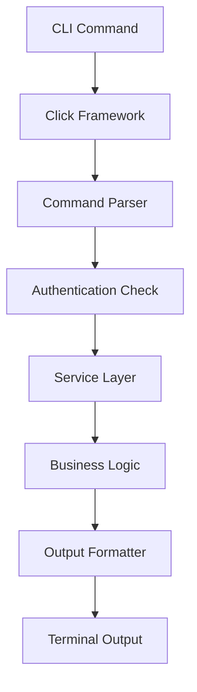

# CLI Architecture

**flext-cli structure and design patterns for CLI functionality.**

**Last Updated**: September 17, 2025 | **Version**: 0.9.9 RC

---

## Architecture Overview

### Design Philosophy

flext-cli provides CLI interfaces for the FLEXT ecosystem using a layered architecture that separates framework concerns from business logic.

**Core Principles**:

- **Separation of Concerns** - CLI interface separate from business logic
- **Framework Abstraction** - Click integration contained to specific modules
- **FLEXT Integration** - Uses flext-core patterns for consistency
- **Type Safety** - Python 3.13+ type annotations throughout

---

## Module Structure

### CLI Interface Layer

```
src/flext_cli/
├── cli.py                    # Main CLI entry point (Click framework integration)
├── aliases.py                # Command aliases and shortcuts
└── cli_main.py              # CLI application setup
```

### Service Layer

```
├── auth.py                   # Authentication service integration
├── config.py                 # Configuration management
├── client.py                 # HTTP client for external services
└── core.py                   # Core CLI service implementation
```

### Infrastructure Layer

```
├── context.py                # CLI execution context
├── exceptions.py             # CLI-specific exception types
├── constants.py              # CLI constants and defaults
├── models.py                 # CLI domain models
└── typings.py               # Type definitions
```

### Support Layer

```
├── formatters.py             # Output formatting (Rich integration)
├── decorators.py             # CLI decorators and utilities
├── interactions.py           # User interaction helpers
└── logging_setup.py         # CLI logging configuration
```

---

## CLI Command Architecture

### Command Structure

```python
# CLI commands are organized by functional groups
auth_commands = {
    "status": check_auth_status,
    "login": handle_login,        # Future implementation
    "logout": handle_logout       # Future implementation
}

config_commands = {
    "show": show_configuration,
    "set": set_config_value      # Implementation varies
}

debug_commands = {
    "info": show_debug_info,
    "logs": show_logs           # Basic implementation
}
```

### Command Execution Flow



---

## Authentication Architecture

### Token Management

```python
from flext_cli import FlextCliAuth

# Authentication service handles token lifecycle
auth = FlextCliAuth()
token_result = auth.get_auth_token()    # Retrieve stored token
save_result = auth.save_auth_token(token)   # Store new token
clear_result = auth.clear_auth_tokens()     # Remove all tokens
```

### Integration Points

- **File-based Storage** - Tokens stored in user's home directory
- **FlextResult Pattern** - All operations return FlextResult for error handling
- **Optional flext-auth** - Integration with flext-auth services when available

---

## Configuration Architecture

### Configuration Management

```python
from flext_cli import FlextCliConfigs

# Configuration supports profiles and multiple sources
config = FlextCliConfigs(
    profile="development",
    debug=True
)

# Configuration validation using flext-core patterns
validation_result = config.validate_business_rules()
```

### Configuration Sources

1. **Command Line Arguments** - Highest priority
2. **Environment Variables** - Medium priority
3. **Configuration Files** - Lowest priority
4. **Default Values** - Fallback

---

## Output and Formatting

### Framework Abstraction

```python
# Rich framework usage contained to formatters module
from flext_cli.formatters import FlextCliFormatters

formatter = FlextCliFormatters()
# Rich integration isolated here, not exposed to CLI consumers
```

### Output Patterns

- **Text Output** - Simple text for basic information
- **Structured Data** - JSON format for programmatic consumption
- **Error Handling** - Consistent error formatting across commands

---

## Extension Patterns

### Adding New Commands

1. **Create Command Function**

   ```python
   def new_command(ctx, options):
       # Implementation using FlextResult pattern
       result = perform_operation(options)
       return handle_result_output(result)
   ```

2. **Register with CLI Framework**

   ```python
   # Add to appropriate command group in cli.py
   ```

3. **Add Tests**

   ```python
   # Create tests in tests/test_new_command.py
   def test_new_command_success():
       # Test command execution
       pass
   ```

### Service Integration

```python
from flext_core import FlextDomainService, FlextResult

class NewCliService(FlextDomainService):
    def process_request(self, data: dict) -> FlextResult[str]:
        # CLI service implementation
        return FlextResult[str].ok("success")
```

---

## Quality and Testing

### Testing Architecture

- **Unit Tests** - Individual component testing
- **Integration Tests** - CLI command end-to-end testing
- **Functional Tests** - User workflow testing

### Quality Standards

- **Type Safety** - MyPy strict mode compliance
- **Code Quality** - Ruff linting standards
- **Error Handling** - FlextResult pattern usage
- **Documentation** - All public APIs documented

---

## Framework Dependencies

### Click Framework (8.2+)

- **Usage** - Command-line interface framework
- **Isolation** - Direct imports limited to cli.py
- **Future** - Considering Typer migration for 2025 standards

### Rich Library (14.0+)

- **Usage** - Terminal output formatting
- **Isolation** - Direct imports limited to formatters.py
- **Integration** - Enhanced output capabilities

### FLEXT Ecosystem

- **flext-core** - Foundation patterns (FlextResult, FlextContainer)
- **flext-auth** - Optional authentication service integration
- **flext-grpc** - Future distributed CLI capabilities

---

For API details, see [api-reference.md](api-reference.md).
For development guidelines, see [development.md](development.md).
